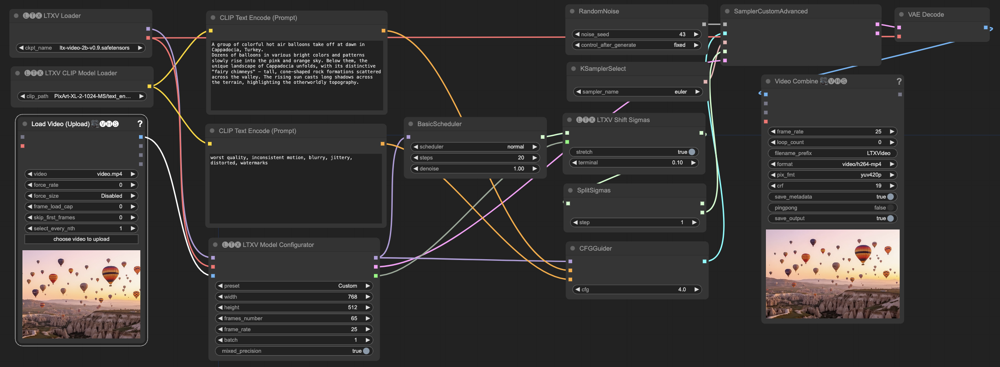

# ComfyUI-LTXVideo
ComfyUI-LTXVideo is a collection of custom nodes for ComfyUI designed to integrate the LTXVideo diffusion model. These nodes enable workflows for text-to-video, image-to-video, and video-to-video generation. The main LTXVideo repository can be found [here](https://github.com/Lightricks/LTX-Video).

## Installation

1. Install ComfyUI
2. Clone this repository to `custom-nodes` folder in your ComfyUI installation directory.
3. Install the required packages:
```bash
cd custom_nodes/ComfyUI-LTXVideo && pip install -r requirements.txt
```
4. Download [ltx-video-2b-v0.9.safetensors](https://huggingface.co/Lightricks/LTX-Video/blob/main/ltx-video-2b-v0.9.safetensors) from Hugging Face and place it under `models/checkpoints`.
5. Clone the text encoder model to `models/text_encoders`:
```bash
cd models/text_encoders && git clone https://huggingface.co/PixArt-alpha/PixArt-XL-2-1024-MS
```

## Example workflows

Note that to run the example workflows, you need to have [ComfyUI-VideoHelperSuite](https://github.com/kosinkadink/ComfyUI-VideoHelperSuite) installed.

### Text-to-video

[Download workflow](assets/ltxvideo-t2v.json)


### Image-to-video

[Download workflow](assets/ltxvideo-i2v.json)


### Video-to-video

[Download workflow](assets/ltxvideo-v2v.json)

